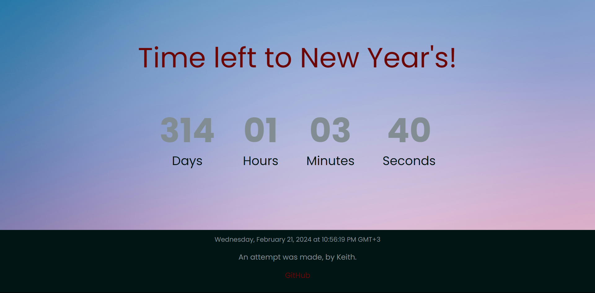

## This is the final look of the countdown timer. The timer is written in HTML, CSS and majority of the functionality is done through JavaScript. 

## Comments, feedback and other information is well appreciated. You can fork the project and use it in your own work. 